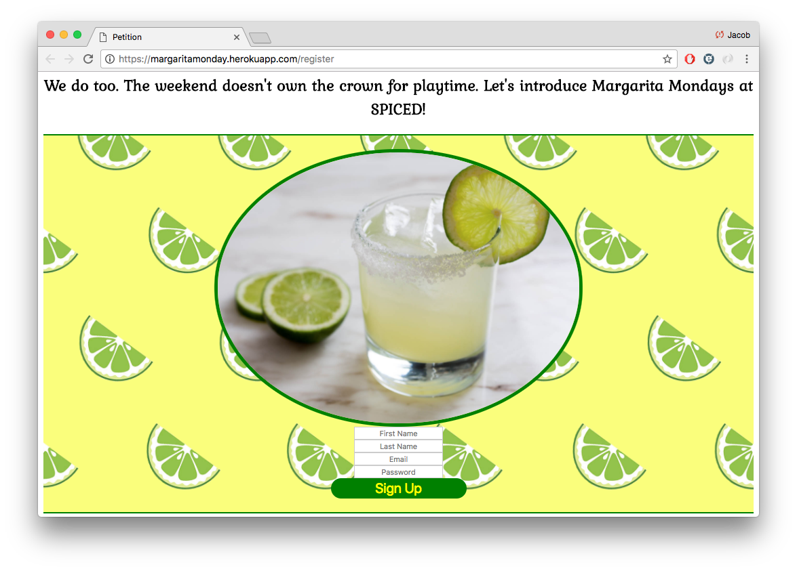

# Petition Project

## Website
https://margaritamonday.herokuapp.com/register

## Overview

This application is a full stack project where users can sign a petition and then access a page to see all other signers.

## Technology

-- Application built with Node.js and Handlebars --
 - Utilized HTML/CSS, Node, Express, Handlebars, and PostgresSQL.
 - Users can register or login to sign a Canvas to implement Margarita Mondays.
 - Once logged in, users can can edit their profiles and see all others who have signed.

This petition is a website where users can create an account by registering. Users can also log in if they have already registered.

Once registered or logged in, the user is prompted to sign their signature on a canvas.

Once the signature is submitted, the user is sent to their home screen where they have multiple options. They can redo their signature, edit their profile, view other users who have signed, or logout.

